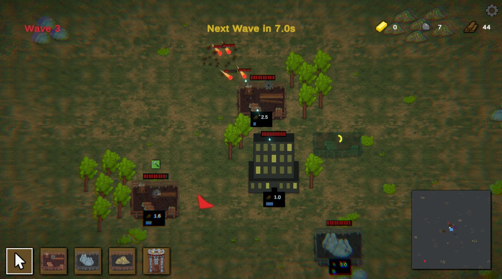
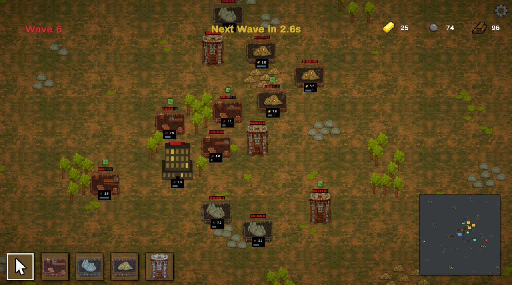

# 🏰 Towerforge: Builder Defence

Towerforge: Builder Defense is a 2D tower defense game developed on Unity, in which the player must defend their base from waves of enemies using defensive towers and building elements.

## 📸 Screenshots

<p align="center">
  
  
</p>

## 🎮 Features

- Defend your base from waves of enemies
- Build and place towers
- Simple and intuitive controls
- Elements of strategy and tactics
- Minimalist 2D style
- Day/Night cycle

## 🚀 Installation and launch

1. Make sure you have **Unity Hub** and **Unity Editor** installed in a version compatible with your project (e.g., Unity `2022.3.X` or see `ProjectSettings/ProjectVersion.txt`).
2. Clone the repository:
   ```bash
   git clone https://github.com/RochiFox/towerforge-builder-defence.git
3. Open the project via Unity Hub.
4. Click Play to launch the game in the editor.

## 🎮 Play the Game

⬇️ [Download Windows Build](https://github.com/RochiFox/towerforge-builder-defence/releases/latest)
